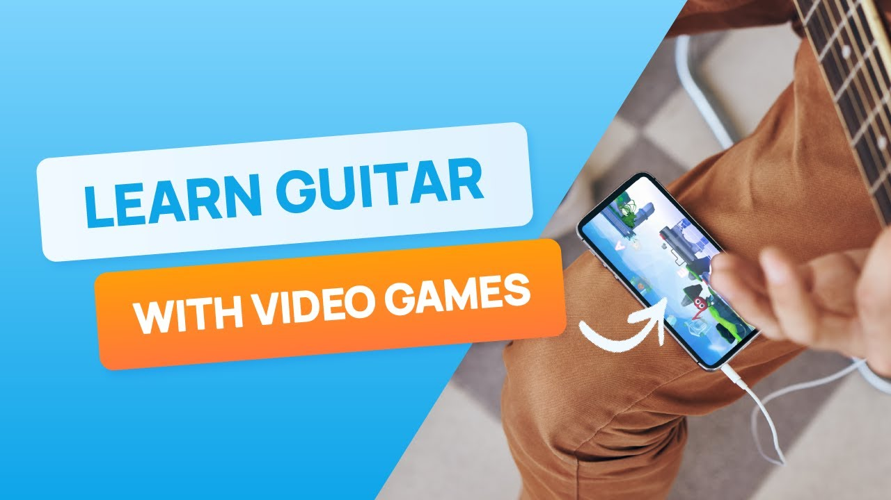

# YouTube & Video Content

## Official Notey Video

### How to learn guitar the FUN way | Notey's World

**URL:** https://www.youtube.com/watch?v=sNFQGLrWH3s
**Published:** May 7, 2024
**Channel:** Notey Inc

**Description Excerpt:**
"Notey's World turns guitar practice into playtime. Check out the app that helps you master guitar with boss fights, fun minigames, and different worlds to explore!"

**Watch:** [▶️ Play on YouTube](https://www.youtube.com/watch?v=sNFQGLrWH3s)

**Key Visual Elements (to be captured):**
- 3D game worlds gameplay footage
- Boss battle sequences
- Guitar detection/feedback UI
- Character customization (outfits)
- Minigame variety
- Level progression interface

## Video Marketing Strategy

### Content Approach
- **Hook:** "Learn guitar the FUN way"
- **Value Prop:** Gaming + education combined
- **Target:** Parents and young learners
- **Tone:** Energetic, playful, accessible

### Visual Storytelling
From App Store and descriptions:
- 3D animated game world
- Character avatar (Notey) as companion
- Real-time note recognition visualization
- Progress tracking (points, stickers, levels)
- Boss fight cinematics
- Minigame variety (brain breaks)

## Recommended Video Analysis Actions

### For AK's Deep Dive:
1. **Watch the YouTube video** to understand:
   - Actual gameplay mechanics
   - UI/UX quality
   - Audio detection accuracy demos
   - Engagement hooks
   - Tutorial onboarding flow

2. **Screenshots to capture:**
   - Main menu/lobby
   - In-game guitar detection overlay
   - Boss battle sequences
   - Progress/rewards screens
   - Customization options
   - Song library interface

3. **Gameplay Analysis:**
   - How does the audio detection work?
   - What's the core game loop?
   - How is difficulty progression handled?
   - What are the retention mechanics?

## Competitor Video Comparison

### Suggested Research:
| Competitor | Video Search Terms |
|------------|-------------------|
| Yousician | "Yousician gameplay guitar" |
| Simply Piano | "Simply Piano guitar mode" |
| Rocksmith+ | "Rocksmith+ gameplay" |

### Key Differentiation to Look For:
- **Notey:** Gamified 3D world, kid-focused, story-driven
- **Yousician:** Clean UI, skill path progression, broader instruments
- **Rocksmith:** Professional audio interface, console/PC focus

## User-Generated Content Opportunities

### YouTube Search Strategy:
1. Search: "Notey app review" 
2. Search: "Notey guitar learning"
3. Search: "Notey vs Yousician"
4. Search: "Notey's World gameplay"

### Platforms to Monitor:
- YouTube (reviews, gameplay)
- TikTok (short-form demos)
- Instagram (parent testimonials)
- Reddit (r/guitar, r/learnguitar)

## Video Assets Needed for Full Analysis

### From Notey:
- [x] Official promo video (YouTube)
- [ ] Tutorial/walkthrough videos
- [ ] Teacher testimonial videos
- [ ] Parent testimonial videos
- [ ] App Store preview videos

### From Users:
- [ ] Honest review videos
- [ ] "First impression" videos
- [ ] Progress showcase videos
- [ ] Comparison videos

## Notes on Video Analysis

**Current Limitation:** Browser tool unavailable for video screenshot capture.

**Workaround:** Manual video review recommended. Key timestamps to note:
- 0:00-0:15: Hook/intro
- 0:15-0:45: Core gameplay demonstration
- 0:45-1:15: Feature showcase
- 1:15+: Call to action

**For Deep Dive:** AK should watch the YouTube video directly and note:
1. Production quality
2. Game mechanics clarity
3. Value proposition communication
4. Target audience alignment
